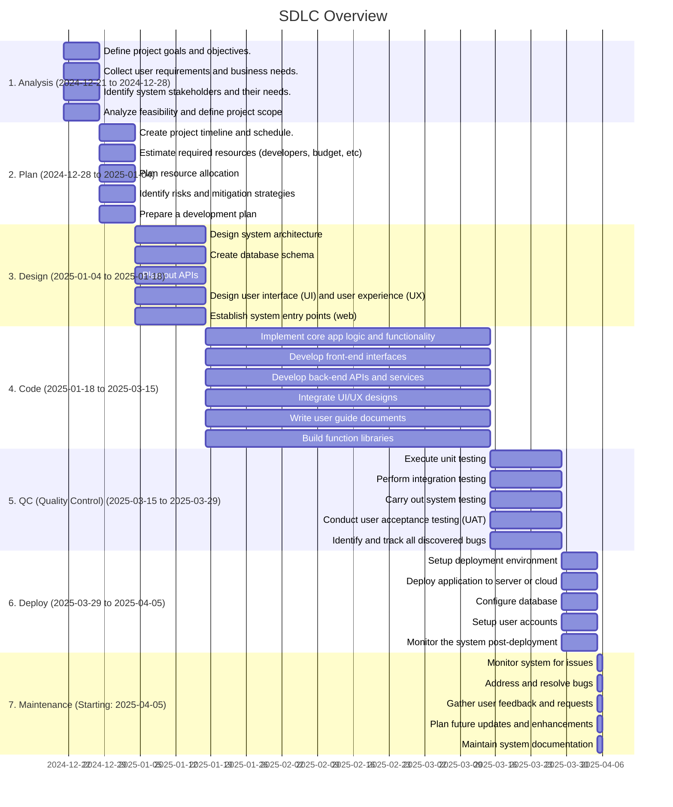

# SmartCommerce Project Overview

## Project Description

This project focuses on developing the SmartCommerce platform, including the following apps: `core, courses, marketplace, payment`.

## Project Team

- **Project Manager**: [PM](projectmanager.md)
- **Tech Lead**: [Tech Lead](techlead.md)
- **Developers**: 3 people.

For detailed responsibilities, please refer to the roles' specific pages.

## SDLC Overview

## Detailed Stages

### 1. Analysis

- **Description:** Gather initial requirements and understand project scope.
- **Documentation Directory:** [1. Analysis](./01. 1. Analysis)
- **Tasks:**
  - Define project goals and objectives.
  - Collect user requirements and business needs.
  - Identify system stakeholders and their needs.
  - Analyze feasibility and define project scope

- **Deliverables:**
  - SOW (Statement of Work)
  - Requirements List
  - Collected Data
  - Testing Method Strategy
  - Budget Allocation
  - High-Level Architecture Plan

- **Timeline:**
  - **Start:** 2024-12-21
  - **End:** 2024-12-28

- **Roles:**
  - Product Owner
  - Project Manager
  - Business Analyst
  - CTO

### 2. Plan

- **Description:** Plan the project's schedule, resources, and dependencies.
- **Documentation Directory:** [2. Plan](./02. 2. Plan)
- **Tasks:**
  - Create project timeline and schedule.
  - Estimate required resources (developers, budget, etc)
  - Plan resource allocation
  - Identify risks and mitigation strategies
  - Prepare a development plan

- **Deliverables:**
  - Project Plan
  - Timeline Schedule
  - Resource Allocation List

- **Timeline:**
  - **Start:** 2024-12-28
  - **End:** 2025-01-04

- **Roles:**
  - Project Manager
  - CTO

### 3. Design

- **Description:** Design the software architecture and user interface.
- **Documentation Directory:** [3. Design](./03. 3. Design)
- **Tasks:**
  - Design system architecture
  - Create database schema
  - Plan out APIs
  - Design user interface (UI) and user experience (UX)
  - Establish system entry points (web)

- **Deliverables:**
  - Diagram of software architecture
  - Entry points list (web)
  - API Endpoints list
  - UI/UX Designs

- **Timeline:**
  - **Start:** 2025-01-04
  - **End:** 2025-01-18

- **Roles:**
  - System Architect
  - UX/UI designers

### 4. Code

- **Description:** Write the source code for the software.
- **Documentation Directory:** [4. Code](./04. 4. Code)
- **Tasks:**
  - Implement core app logic and functionality
  - Develop front-end interfaces
  - Develop back-end APIs and services
  - Integrate UI/UX designs
  - Write user guide documents
  - Build function libraries

- **Deliverables:**
  - Source code
  - User guide documentation
  - Function libraries

- **Timeline:**
  - **Start:** 2025-01-18
  - **End:** 2025-03-15

- **Roles:**
  - Front-end Devs
  - Back-end Devs

### 5. QC (Quality Control)

- **Description:** Test the software to identify and fix bugs.
- **Documentation Directory:** [5. QC (Quality Control)](./05. 5. QC (Quality Control))
- **Tasks:**
  - Execute unit testing
  - Perform integration testing
  - Carry out system testing
  - Conduct user acceptance testing (UAT)
  - Identify and track all discovered bugs

- **Deliverables:**
  - List of bugs and issues
  - Testing reports

- **Timeline:**
  - **Start:** 2025-03-15
  - **End:** 2025-03-29

- **Roles:**
  - Solutions Architect
  - QC Engineer
  - Tester
  - DevOps
  - Trial, Users Test

### 6. Deploy

- **Description:** Deploy the software to the production environment.
- **Documentation Directory:** [6. Deploy](./06. 6. Deploy)
- **Tasks:**
  - Setup deployment environment
  - Deploy application to server or cloud
  - Configure database
  - Setup user accounts
  - Monitor the system post-deployment

- **Deliverables:**
  - Ready to run software

- **Timeline:**
  - **Start:** 2025-03-29
  - **End:** 2025-04-05

- **Roles:**
  - DevOps
  - Database Admin
  - Business (sign)

### 7. Maintenance

- **Description:** Provide ongoing support and enhancements.
- **Documentation Directory:** [7. Maintenance](./07. 7. Maintenance)
- **Tasks:**
  - Monitor system for issues
  - Address and resolve bugs
  - Gather user feedback and requests
  - Plan future updates and enhancements
  - Maintain system documentation

- **Deliverables:**
  - Drawbacks and issues
  - Next Version Plan
  - User feedback

- **Timeline:**
  - **Start:** 2025-04-05
  - **End:** Ongoing

- **Roles:**
  - Users
  - Testers
  - Support Managers

